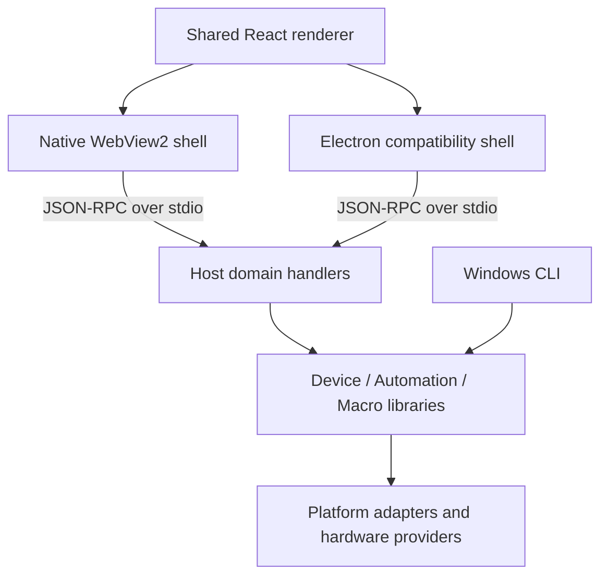

# Universal Device Toolkit Architecture

## Overview

Universal Device Toolkit (UDT, formerly Lenovo Legion Toolkit) is a Windows-first desktop application with a default native WebView2 shell, a separate Electron compatibility shell, a shared React interface and a headless .NET backend. Supported Windows machines expose catalog-backed hardware controls; other machines use safe basic-mode workflows. macOS and Linux have experimental portable Host, Electron-shell, and diagnostics-CLI surfaces. New hardware support lands in the official Host and brand providers (see [DEVICE_PROVIDERS.md](./DEVICE_PROVIDERS.md)); the plugin system was retired in 6.1 and is not an extension path.

## Repository layout

| Directory | Responsibility |
| --- | --- |
| `Apps/` | Native Windows shell, shared React/Electron compatibility shell, Host, Windows CLI, portable diagnostics CLI, and NetworkProxy worker |
| `Libraries/` | Device business logic, portable contracts and utilities, automation, macros, and CLI support |
| `Platforms/` | Windows, portable Windows core, Linux, and macOS adapters |
| `Tests/` | Contracts, fast, unit, stateful, cross-platform, and shared test infrastructure |
| `Tools/` | Hardware validation, SpectrumTester, Unicode checks, and localization maintenance |

Project filenames, assembly identities, and solution project GUIDs stay stable. The root solution and npm scripts remain the build entry points. Application data and installed payload paths are independent of source directory names.

The renderer follows `app / features / shared`. `app` composes startup, navigation and modal hosts. Each feature owns its UI, bridge clients and state. Shared modules provide infrastructure and cannot import feature modules. Network polling owns its state independently of system optimization and discards responses from an earlier start/stop session.

Host handlers live in `Device`, `Telemetry`, `Actions`, `Keyboard`, `Tools`, `Settings` and `Application`; `Rpc` contains transport, dispatch and errors. Telemetry separates snapshot composition, subscription lifetime, FPS and settings without adding a forwarding layer. Sensor providers share the snapshot envelope and memory-unit mapping while preserving unavailable fields as null.

`Libraries/Device` groups sensors, fan curves, lighting and application updates in `Sensors`, `Cooling`, `Lighting` and `Updates`. Models live beside their domain. Existing public namespaces intentionally remain stable for consumers and serialized types. Platform adapters and the signed fan-extension loading boundary remain separate.

## Quick Start

### For Users

1. **Download** the WebView2 package from [GitHub Releases](https://github.com/SSC-STUDIO/UniversalDeviceToolkit/releases). The Electron compatibility package is a separate choice for unresolved WebView2 issues.
2. **Install** the application by running the installer
3. **Launch** UDT and configure your preferred settings
4. **Use** supported hardware controls or basic-mode Host and system tools

### For Developers

1. **Prerequisites**: Install .NET 10 SDK, an IDE that supports it, Node.js 22, and Microsoft Edge WebView2 Runtime for native-shell checks.
2. **Clone** the repository: `git clone https://github.com/SSC-STUDIO/UniversalDeviceToolkit.git`
3. **Build** the solution: `dotnet build UniversalDeviceToolkit.sln`
4. **Run** tests: see [TEST_DIAGNOSTICS.md](./TEST_DIAGNOSTICS.md) (`Tests.Contracts` → `Fast.Tests` → `Tests` → `Tests.Stateful`)
5. **Build the Windows packages**: publish the self-contained win-x64 Host, then run `npm run dist:win` and `npm run dist:win:compatibility` in `Apps/Electron`; see [DEPLOYMENT.md](./DEPLOYMENT.md). For renderer hot reload, run `npm ci` followed by `npm run dev` in that directory.
   In Visual Studio, set the `Apps/Electron` launcher project as
   the startup project and press F5 (its "Electron (npm run dev)" launch profile
   runs `npm run dev`). Do **not** set `Apps/Host` as the startup
   project; it is a headless backend spawned automatically by either shell.
6. **Start** developing! See [CONTRIBUTING.md](../CONTRIBUTING.md) for the build, test, and culture-naming rules.

## System Architecture

The default Windows shell is the Win32/WebView2 application in `Apps/Windows`. `Apps/Electron` contains the shared React renderer and the separate Electron compatibility shell. Both spawn the same headless .NET Host and forward business calls through the existing JSON-RPC protocol over stdio.

WebView2 owns native windows, tray, dialogs and a lazy independent OSD window. Electron owns equivalent shell surfaces and bundles Chromium. OSD layout and value formatting live in `Apps/Electron/src/shared/osd-presentation.ts`. Each shell subscribes only while its OSD is visible. Main pages retain their cache while hidden; Host polling stays active when either the main window or OSD is visible.

The bridge exposes a readonly `shellVariant` (`webview2`, `electron-compatibility`, or browser preview). About and diagnostics display the shell type. Business RPC remains unchanged.



## Performance and lifecycle

Route modules and heavy charts load on demand. Static chart options and mappings are cached; subscriptions and polling are cancellable. Hidden OSD windows unsubscribe from sensor and FPS streams. Display rendering updates values without rebuilding static nodes.

WebView2 navigation or browser failure is logged and offers a native user-triggered retry. Missing Runtime or initialization failure offers localized Runtime repair and compatibility download choices. Host failures retain separate diagnostics and the existing bounded restart policy.

The WebView2 installer budget is 40,000,000 bytes. No comparative startup or memory measurements are asserted here; see [UI_PERFORMANCE.md](./UI_PERFORMANCE.md) for profiling.

## Platform Notes

The supported product is Windows. The Electron UI shell contains
platform-specific chrome for macOS and Linux, but those paths are
**experimental**: `Release.yml` publishes only Windows NSIS installers with a
win-x64 Host. There is no official macOS/Linux Electron release.

Implementation map (all under `Apps/Electron/src/main/`).
macOS/Linux rows describe existing shell code, not a shipped product:

| Surface | Windows | macOS | Linux | Implementation |
|---|---|---|---|---|
| Title bar | Frameless custom title bar with right-aligned window buttons (Mica background material) | Native title bar with traffic lights (hiddenInset) + vibrancy | Frameless custom title bar with right-aligned window buttons | `index.ts` `createWindow()` (`frame: false` / `titleBarStyle: 'hiddenInset'` branch); renderer `TitleBar.tsx` hides its buttons on `darwin` |
| Menu bar | Auto-hidden (frameless) | Native system menu bar (App/File/Edit/View/Window/Help roles) | Auto-hidden (frameless) | `menu.ts` `installApplicationMenu()` — macOS only; `hasNativeMenuBar()` |
| Tray | Tray icon + custom flyout (navigation, quick actions, open/close) | Tray icon + custom flyout | Tray icon + custom flyout | `tray.ts` `initTray()` — all platforms |
| OSD overlay | Transparent always-on-top window fed by Host sensor data | Same window; no meaningful sensor data in basic mode | Same window; no meaningful sensor data in basic mode | `osd-window.ts` |
| System power actions (restart/shutdown/sleep) | Via `shutdown.exe` | Unavailable (spawn fails) | Unavailable (spawn fails) | `system-power.ts` |
| Windows power plans | Via `powercfg` | Unavailable | Unavailable | `power-plans.ts` |
| App lifecycle | Main window hides to tray and retains page cache; status/tray-popup are disposed and hidden OSD is suspended. Restore shows the existing main window. | Same cache behavior; Dock `activate` restores | Same when minimize-to-tray is on; otherwise quit on last window | `index.ts` `enterBackground()` / `restoreMainWindow()` / `window-all-closed` |
| Start on login | Host scheduled task (`app.setAutorun`) launching the installed shell via `UDT_SHELL_PATH` | Electron login item (`app.setLoginItemSettings`) | XDG autostart `.desktop` | Settings page picks the channel by `bridge.platform` |

The shipping Host backend (`.NET`) is Windows-first: it targets the Windows TFM
`net10.0-windows10.0.26100.0` and drives hardware through WMI/registry/vendor
drivers. Official releases embed the self-contained `win-x64` publish output.
A portable `net10.0` Host (`UDTWindows=false` / `UDT_PLATFORM=linux|macos`)
exists for experimental macOS/Linux work and registers Windows-only RPC names
as `-32099`. Official Host and brand providers target Windows TFMs. Per-platform Host publish
details are in [DEPLOYMENT.md](DEPLOYMENT.md).

### Shell-owned methods

These `bridge:invoke` methods are answered by the shell. Electron implementations
are listed below; the native shell implements the same renderer contract.
They handle OS windows, dialogs, updater transport and installer launch rather
than hardware business logic:

| Method | Owner |
|---|---|
| `powerPlans.getList` / `powerPlans.setActive` | `power-plans.ts` (`powercfg`, Windows only) |
| `power.restart` / `power.shutdown` / `power.sleep` | `system-power.ts` |
| `update.getRelease` / `update.download` / `update.launchInstaller` | `update-downloader.ts` (GitHub release + installer launch) |
| `device.info` | Main-process device snapshot (falls back to `system.info` in the UI) |
| `dialog:*`, `log.open-folder`, `status-window.show` | Native dialogs, folders, tray status popup |

Non-Windows Host builds register the Windows-only RPC names as `-32099`
(`Not supported on this platform.`) so the renderer never waits on unknown-method
errors. The plugin system was retired in 6.1; those marketplace method names
are no longer part of the Host RPC surface.

Host JSON-RPC errors keep their numeric code in the message as `[UDT:<code>]`
so the UI can map `-1006` (elevation), `-1010` (missing NetworkProxy), `-1011`
(Hosts mode refused), `-1012` (start refused), and `-32099`.

## Core Components

### 1. Apps/Windows and Apps/Electron (Presentation Layer)

The Windows native shell hosts the shared renderer through WebView2. Electron
provides compatibility windows and experimental non-Windows UI. Both shells
spawn the Host and implement the same bridge:

- **`src/renderer/`**: `app` owns startup, navigation and dialog composition; `features` groups dashboard, actions, keyboard, tools, settings and about; `shared` provides UI primitives, bridge contracts, formatting, settings and themes. Each feature keeps its components, APIs, stores and styles together. Tools groups cleanup, network, drivers, system and pointer.
- **`src/main/`**: Main process shell — window creation (`index.ts`), tray (`tray.ts`), OSD (`osd-window.ts`), macOS menu (`menu.ts`), single-instance, dialogs, host client (`host-client.ts`), path/URL and power-action guards
- **`src/preload/`**: Context-isolated bridge (`index.ts`)
- **`Apps/Windows/`**: Win32 windows, tray, native dialogs, WebView2 bridge, OSD, recovery and transactional installation helpers

### 2. Libraries/Device (Core Library; assembly `UniversalDeviceToolkit.Lib`)

The heart of the application containing:

#### Controllers and hardware features
- `WindowsPowerModeController`: Windows power mode management
- `GodModeController` implementations: fan curves and device power limits
- `RGBKeyboardBacklightController` and `SpectrumKeyboardBacklightController`: keyboard lighting
- `GPUController`: GPU mode switching (dGPU, Hybrid, iGPU)
- `SensorsController` implementations: vendor and generic sensor data

#### Domain services
- Settings and backups: persistent configuration and recovery
- Updates: release discovery and package metadata
- Game detection: active game matching and performance coordination
- Network acceleration: diagnostics, routing and state recovery

#### Features
- `IAutomationFeature`: Automated actions based on triggers
- `ITriggerFeature`: Event-driven automation

#### Native Interop
- `Native.cs`: P/Invoke declarations for Windows APIs
- WMI integration for hardware queries
- ACPI communication for firmware access

### 3. Libraries/Automation

Automation system implementing a rule-based engine:

- **Triggers**: Application launch, game detection, AC plugged/unplugged
- **Conditions**: Time-based, power state, user presence
- **Actions**: Power mode change, fan curve, RGB profile, macro activation

### 4. Libraries/Macro

Macro recording and playback system:

- Key sequence recording
- Macro storage and management
- Integration with hardware macro keys

### 5. Apps/CLI

Command-line interface for headless operation:

- Power mode queries and changes
- Status monitoring
- Automation rule management

## Renderer Security Boundary

The plugin system was retired in 6.1. Electron's renderer uses its sandbox,
`contextIsolation` and no Node.js integration. WebView2's renderer has no Node.js
environment and calls its origin-restricted message bridge. Privileged work
reaches the shell and Host only through the corresponding bridge:

- IPC handlers accept requests from the current main window's main frame only
- `window.open` and unexpected top-level navigation are denied
- External URLs must be HTTP(S); renderer-supplied paths cannot open executables or scripts
- Power actions are rate limited in the main process

Former plugin capabilities now live as built-in Host features (cursor and
pointer controls on the Mouse page; network acceleration under System
Optimization). Legacy `%LOCALAPPDATA%\UniversalDeviceToolkit\plugins` data is
not loaded.

## Data Flow

### Power Mode Change Flow

```
User Action (UI)
      -> Renderer api/ bridge.invoke('feature.setPowerMode', ...)
      -> Shell bridge -> Host JSON-RPC
      -> Host feature handler and device power-mode feature
      -> WMI Call (\\ROOT\WMI\Lenovo_Path)
      -> ACPI Communication
      -> Hardware Response
      -> Windows Power Plan Sync
      -> State Update Broadcast (bridge:event)
      -> UI Refresh
```

### Game Detection Flow

```
GameDetectionService (Background Monitor)
      -> Window Title / Process Matching
      -> Host event broadcast
      -> Automation Rules Evaluation
      -> Automatic Actions Execution
```

### Bridge RPC error codes

Error codes are defined once in `Apps/Host/Rpc/BridgeErrorCodes.cs`
and mapped to localized messages by the renderer (`src/renderer/src/shared/bridge/bridge.ts`).

- `-32601` unknown method, `-32602` invalid params, `-32603` internal error,
  `-32800` request cancelled (JSON-RPC protocol range, produced by
  `BridgeRpcServer` and handler argument validation).
- `-32099` platform not supported: whole Windows-only domain on a portable
  host. The method list lives in `Rpc/RpcMethodNames.cs` - the single source
  shared by the Windows registration check (`Program.VerifyRpcSurface`) and
  the portable stubs, so the two surfaces cannot drift.
- `-32001` God Mode not supported by the device generation.
- `-1001` feature not supported, `-1002` AC power required, `-1004` undefined
  state, `-1005` macro hooks failed, `-1006` elevation required,
  `-1010` NetworkProxy.exe missing, `-1011` hosts mode refused,
  `-1012` network start refused (application-level conditions).

## Technology Stack

| Layer | Technology/Framework |
|-------|---------------------|
| UI Framework | Native WebView2 / Electron compatibility + shared React 19 (Vite, Ant Design, ECharts) |
| UI Logic | React components + Zustand stores; `api/*` typed bridge wrappers |
| Backend | .NET 10 headless Host (`Apps/Host`) over JSON-RPC (stdio) |
| Architecture | Clean Architecture (UI shell ↔ Host ↔ Core Lib) |
| DI Container | Autofac (Host) |
| Hardware Access | WMI, ACPI, Windows native APIs (Windows only) |
| Monitoring | Built-in sensors and controller queries |
| Settings | JSON file storage |
| Updates | GitHub Releases API |
| Localization | Crowdin + shared renderer i18n TS modules + native catalogs + `.resx` satellites |

## Namespace and assembly naming

User-facing product names use **Universal Device Toolkit**. The plugin host
assembly (`UniversalDeviceToolkit.Lib.Plugins`) was removed in 6.1.

| Surface | Primary identity |
| --- | --- |
| Product / shell process | Universal Device Toolkit |
| Core Lib assembly / namespaces | `UniversalDeviceToolkit.Lib` |
| Windows IPC CLI executable | `udt.exe` (`AssemblyName` = `udt`; `udt-cli.exe` one-train alias) |
| Cross-platform diagnostics CLI | `udt` (`Apps/CrossPlatformCLI`, framework-dependent `udt.dll` + `udt`/`udt.cmd`) |

Phase 3 hard cutover from `LenovoLegionToolkit.Lib*` is **complete**. Remaining LLT tokens (legacy IPC pipe `LenovoLegionToolkit-IPC-0`, `BrandCompatibility.Legacy*`, dual-written `LLT_*` env keys, packaging IDs) are deliberate compatibility surfaces — not the primary ABI. Plugin load prefixes were removed with the plugin system in 6.1.

See **[NamespaceMigration.md](./NamespaceMigration.md)** for the RootNamespace/AssemblyName inventory, completed Phases 0–3, and remaining legacy compat notes.

## Key Design Decisions

1. **No Background Service**: Application runs only when user is logged in
2. **No Telemetry**: Complete user privacy
3. **Lightweight**: Minimal resource footprint
4. **Official Host + brand providers**: New device workflows land in Host RPC and in-tree brand providers, not third-party modules (see [DEVICE_PROVIDERS.md](./DEVICE_PROVIDERS.md))
5. **Catalog-backed Device Support**: Data-driven hardware/basic-mode profiles across Lenovo families and common PC vendors
6. **Primary ABI is UDT-named**: Core Lib assemblies are `UniversalDeviceToolkit.Lib*`; the Host still accepts selected dual pipes during transition (see [NamespaceMigration.md](./NamespaceMigration.md))

## Platform Compatibility

- **Windows**: 10 (1809+), 11 (x64 only) — supported product (full hardware control + basic mode)
- **macOS / Linux**: experimental only (portable Host, Electron shell, CrossPlatform CLI). No official Electron release. Hardware control is Windows-only. Official Host and brand providers are Windows TFMs.
- **Hardware (code-driven detection)**:
  - Hardware-control profiles: Legion 5/Slim 5/Pro 5, Legion 7/Pro 7/9, Legion Go, LOQ, IdeaPad Gaming, ThinkBook, YOGA, Lenovo Slim, selected legacy Lenovo gaming families
  - Basic-mode profiles: ThinkPad, ThinkCentre, ThinkStation, IdeaCentre, Legion desktop, XiaoXin, V series, Motorola, ASUS, MECHREVO/Mechanical Revolution, Dell, HP, Acer, MSI, Microsoft Surface, GIGABYTE/AORUS, Razer, Samsung, HUAWEI, Xiaomi/Redmi, HONOR, LG, Framework, Panasonic, Dynabook/Toshiba, Fujitsu, VAIO, MEDION, XMG/SCHENKER, System76, Star Labs, Slimbook, Clevo/Tongfang, and generic PCs
  - v4.0 adds a local device-support simulation matrix for ASUS, MECHREVO, HP, Dell, Acer, Xiaomi, and Huawei machine profiles, plus generic CPU/GPU sensor fallback for non-Lenovo basic mode
  - Chinese model naming variants are recognized where hardware control is supported (for example `R7000`, `R9000`, `Y7000`, `Y9000`)
  - Vendor matching normalizes common BIOS/DMI formatting differences so punctuation, casing, spacing, diacritics, and company suffix variants do not block a basic-mode match
  - Detection source: `Libraries/Device/DeviceSupport/CatalogDeviceSupportProvider.cs` and `Libraries/Device/DeviceSupport/LenovoDeviceSupportProvider.cs`
- **Dependencies**: system Microsoft Edge WebView2 Runtime for the primary shell; Chromium is bundled in the compatibility shell. Both bundle a self-contained .NET Host. Lenovo drivers are required only for Lenovo hardware-specific controls.

## Performance Characteristics

- **Measurements**: working set, CPU and ready latency depend on hardware, shell and active surfaces. Publish numbers only with a saved measurement record; see [UI_PERFORMANCE.md](UI_PERFORMANCE.md).
- **Power Impact**: Electron uses EcoQoS when every window is hidden; the Host stays at Normal priority so hotkeys and automation stay responsive.
- **Installers**: WebView2 is primary; Full/Online names are complete identical aliases. The independent Electron compatibility package includes Chromium and native NSIS pages. Host publish output is pruned (`Scripts/Prune-ShippingFootprint.ps1`). Installer EXEs stay `asInvoker` and self-elevate, preserving silent `/S` launches by older clients. New updates remain within their installed shell channel and verify the matching SHA256 manifest entry.

## Security Considerations

- Local-only operation (no cloud dependencies)
- Hardware-level access (requires admin for some features)
- Renderer sandbox (`contextIsolation`, no Node.js) with Host-only privileged work
- Update integrity through named SHA256 manifest matching and pre-launch revalidation; release signatures are verified by the signing workflow when signing is enabled

## Future Architecture Goals

These are historical proposals, not approved work in the 6.1.4 candidate. Any new feature or feature removal needs a separate product decision.

- [ ] Web-based management interface (optional)
- Mobile and Android companion apps are out of scope and are not supported.
- [ ] Cloud sync for settings (privacy-first design)
- [ ] Enhanced telemetry option (opt-in only)
